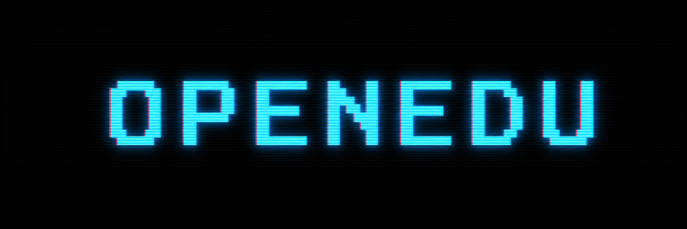
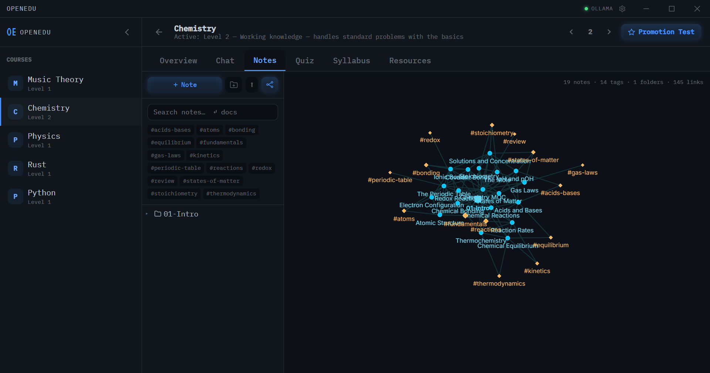
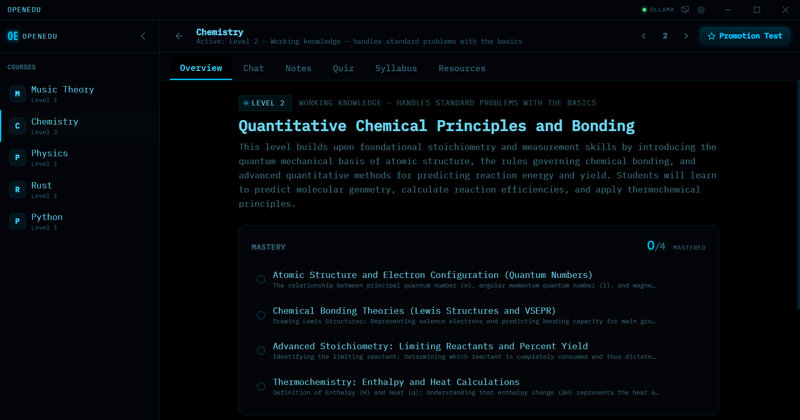
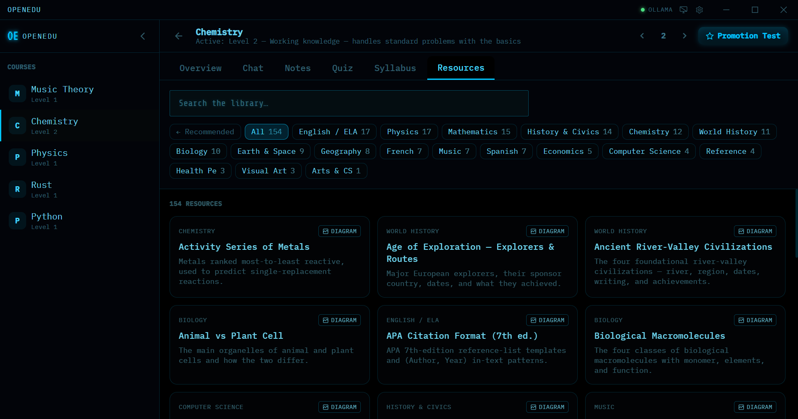
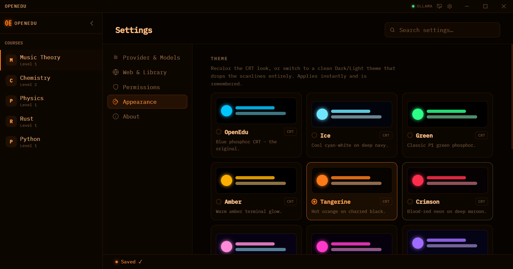
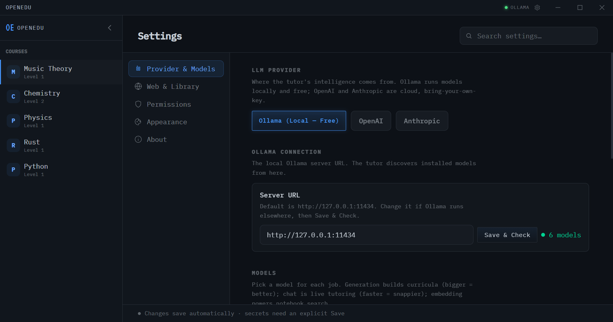

<!-- Hero: CRT "OPENEDU" wordmark — see docs/assets/README.md for the image-gen prompt. -->
<p align="center">
  
</p>

<p align="center">
  <strong>An AI tutor that runs on your machine.</strong><br/>
  Bring-your-own-key, offline-first personalized learning — local on Ollama, with OpenAI / Anthropic as alternates.
</p>

<p align="center">
  <a href="LICENSE"></a>
  <a href="https://github.com/TerraByte-Dev/OpenEdu/releases/latest"></a>
  <a href="https://github.com/TerraByte-Dev/OpenEdu/actions/workflows/ci.yml"></a>
  
</p>

<p align="center">
  <a href="#features">Features</a> ·
  <a href="#screenshots">Screenshots</a> ·
  <a href="#quickstart">Quickstart</a> ·
  <a href="#architecture">Architecture</a> ·
  <a href="#development">Development</a> ·
  <a href="LICENSE">License</a>
</p>

<p align="center">
  <sub>brought to you by</sub><br/>
  <a href="https://github.com/TerraByte-Dev"></a>
</p>

---

OpenEdu generates a focused, 6-level curriculum for **any** topic, then tutors you through it — chat, quizzes,
a notebook with retrieval, and promotion tests — entirely on a local model if you want. It's built to be
**reliable on small models** (verified on `gemma4:e4b`, ~4B effective params) and to work with **no account
and no network**: your data lives in a local SQLite database, and the only outbound calls are to the model
provider you choose.

## Features

- **Generate a course for anything** — a research → outline → tutor-instructions → 6 syllabuses pipeline, fully schema-enforced so it holds up on tiny local models.
- **Bring your own key, or none** — runs free on local **Ollama**; OpenAI and Anthropic are drop-in alternates. Separate model choices for generation vs. chat vs. embeddings.
- **Offline curated Library** — a 150+ card K-12 reference set (periodic table, formulas, definitions, maps…) bundled in the app; the tutor can cite it mid-lesson with zero network.
- **Notebook with retrieval** — an Obsidian-style vault with a live-preview editor, `[[wiki-links]]`, note-free `#tags`, and a vault graph; documents are embedded locally so the tutor can search and cite your notes.
- **Quizzes & promotion tests** — per-level practice plus a code-assembled mastery exam.
- **Tutor permissions** — a per-mode allow / ask / deny policy (Standard · Cautious · Trusting presets) governing what the tutor may do on its own; exam mode locks model help.
- **Themes** — a CRT "blue phosphor" aesthetic with recolors (Amber, Green, Crimson, Synthwave, Ultraviolet…) plus clean **Dark / Light** themes — all CSS-variable driven.

## Screenshots

> Captured live in `npm run tauri dev`. See [`docs/assets/screenshots/README.md`](docs/assets/screenshots/README.md) for the shot list + capture settings.

<p align="center">
  
</p>
<p align="center">
  <sub><b>Notebook vault graph</b> — your notes (circles), <code>#tags</code> (amber diamonds), and folders, woven together by <code>[[wiki-link]]</code> edges.</sub>
</p>

<table>
  <tr>
    <td width="50%" valign="top">
      <br/>
      <sub><b>Course view</b> — a generated 6-level curriculum with mastery tracking, chat, notes, quizzes &amp; a promotion test.</sub>
    </td>
    <td width="50%" valign="top">
      <br/>
      <sub><b>Offline Library</b> — a curated 154-card K-12 reference set the tutor can cite, fully offline.</sub>
    </td>
  </tr>
  <tr>
    <td width="50%" valign="top">
      <br/>
      <sub><b>Themes</b> — a CRT "blue phosphor" look with recolors plus clean Dark/Light, all CSS-variable driven.</sub>
    </td>
    <td width="50%" valign="top">
      <br/>
      <sub><b>Bring your own key</b> — local Ollama (free), or OpenAI / Anthropic; a separate model per job.</sub>
    </td>
  </tr>
</table>

## Quickstart

**Prerequisites**

- [Node.js](https://nodejs.org/) 20.19+ or 22.12+
- [Rust](https://www.rust-lang.org/tools/install) + the [Tauri v2 system dependencies](https://v2.tauri.app/start/prerequisites/) for your OS
- (For the free local path) [Ollama](https://ollama.com/) with a model pulled, e.g. `ollama run llama3`

**Run**

```bash
git clone https://github.com/TerraByte-Dev/OpenEdu.git
cd OpenEdu
npm install
npm run tauri dev      # launches the desktop app
```

On first run, open **Settings** (the gear) to pick your provider/model. With Ollama running locally you're
ready to generate your first course — no key required.

> Prefer a prebuilt installer? Grab the latest signed build from [**Releases**](https://github.com/TerraByte-Dev/OpenEdu/releases/latest) — installed apps auto-update.

## Development

```bash
npm run tauri dev      # dev app with HMR
npm test               # unit tests (vitest)
npm run build          # typecheck (tsc) + frontend bundle (vite)
```

CI runs typecheck + tests + build on every pull request (`.github/workflows/ci.yml`).

## Architecture

The data lives entirely in SQLite (`%APPDATA%/com.terrabyte.openedu/openedu.db` on Windows) — no per-course
files. A few orientation points:

- `src/lib/curriculum.ts` — the generation agent harness (`runGenerationPipeline`).
- `src/lib/llm.ts` — provider abstraction, streaming, schema-enforced structured output, model-tier detection.
- `src/lib/db.ts` — SQLite CRUD; `src-tauri/` — Rust backend + migrations.
- `src/views/settings/` — the themed Settings system ([its README](src/views/settings/README.md)).

Deeper notes: [`CLAUDE.md`](CLAUDE.md) (dev guide), [`V2_ARCHITECTURE.md`](V2_ARCHITECTURE.md), and
[`docs/dev/`](docs/dev/) (development handoffs).

## License

[MIT](LICENSE) © TerraByte Solutions LLC.

<p align="center">
  <a href="https://github.com/TerraByte-Dev"></a><br/>
  <sub>An open-source project by <strong>TerraByte Solutions LLC</strong></sub>
</p>
